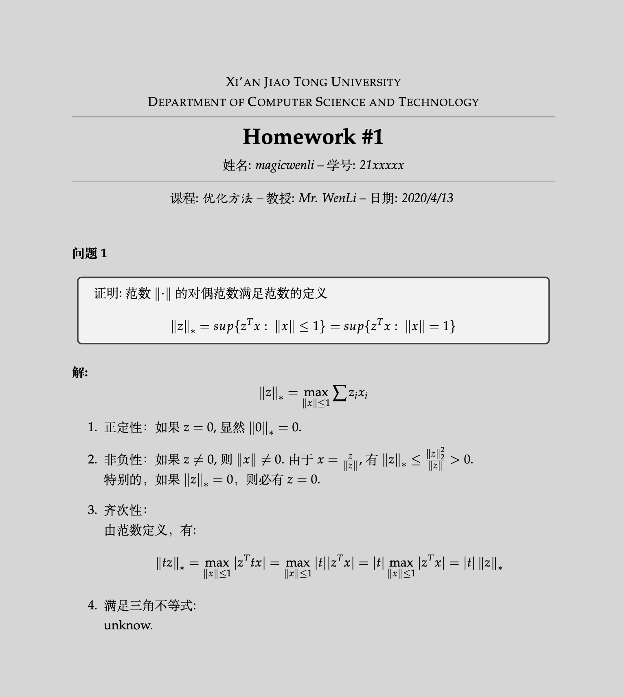

# latex-template-mwhw

## 说明

基于 [fphw Assignment](http://www.latextemplates.com/template/fphw-assignment) 演绎

请使用  编译

## 图片



## 变化

- 增加中文支持(默认为英文)
```latex
\documentclass[
	12pt, % Default font size, values between 10pt-12pt are allowed
	%letterpaper, % Uncomment for US letter paper size
	cn, % Uncomment for Chinese
	%spanish, % Uncomment for Spanish
]{mwhw}
```
- 增加学号输入（可选）
```latex
\IDnumber{21xxxxxx}
```
- 修改`\section`样式

## License

[CC BY-NC-SA 3.0](http://creativecommons.org/licenses/by-nc-sa/3.0/)
