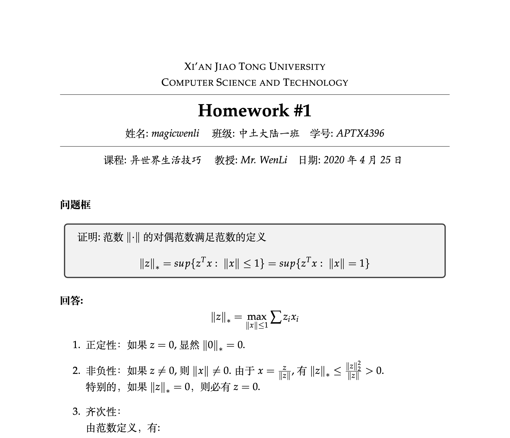
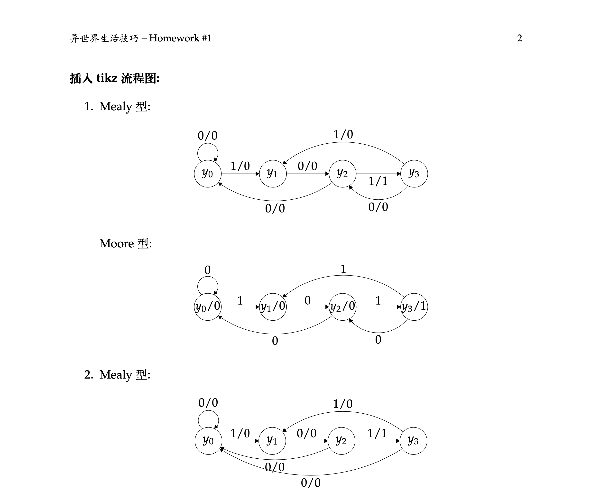
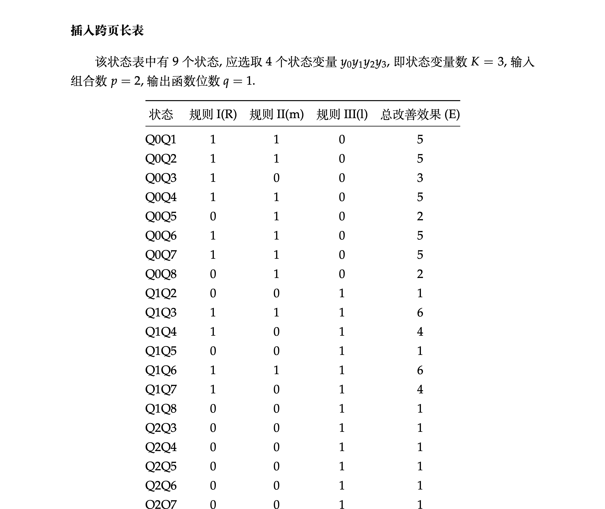
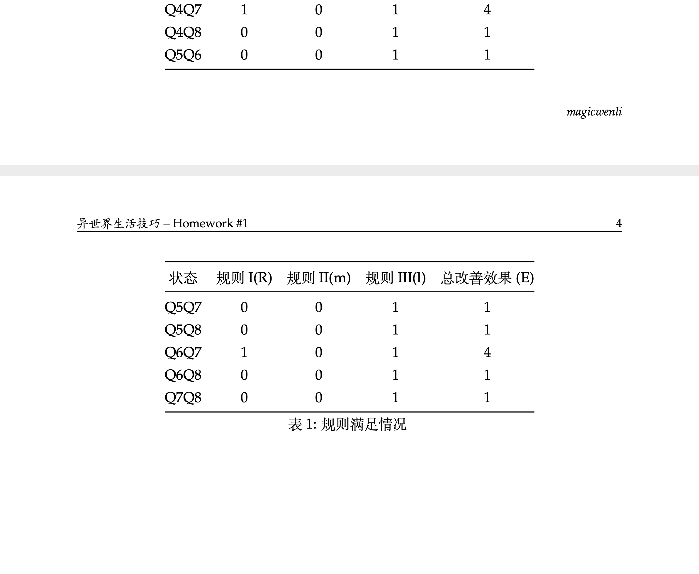

# latex-template-mwhw

## 说明

基于 [fphw Assignment](http://www.latextemplates.com/template/fphw-assignment) 演绎, **请使用 XeLaTeX 编译**

## 图片

[预览](github.com/magicwenli/latex-template-mwhw/main.pdf)

## 变化

V 1.1:

- 增加班级输入(可选)
- 添加样例

V 1.0

- 增加中文支持(默认为中文)
- 增加学号输入（可选）
- 修改`\section`样式

## License

[CC BY-NC-SA 3.0](http://creativecommons.org/licenses/by-nc-sa/3.0/)
